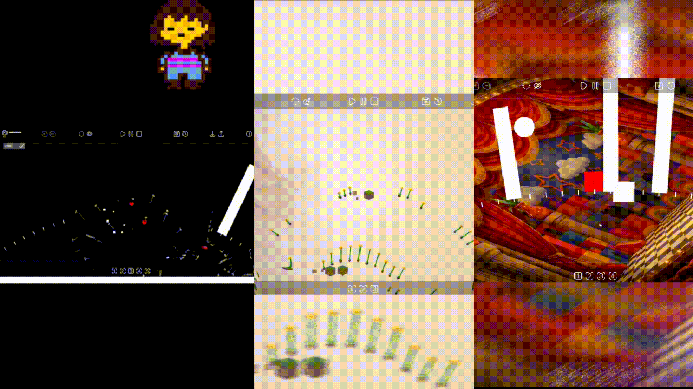

# Donggurami

<p align="center">
  
</p>

> **Unity 기반 Circular Rhythm Sequencer**  
> 원 위에 노트를 배치하고, 서로 다른 크기의 트랙을 조합해 반복되는 리듬과 멜로디를 만드는 인터랙티브 음악 프로젝트입니다.

<p align="center">
  
</p>

<p align="center">
  <a href="https://bulletprooves.com/projects/donggurami/">
    <b>▶ Play Web Version</b>
  </a>
</p>

<p align="center">
  Unity · C# · WebGL · Audio System · Runtime Sequencer
</p>

---

## 🎵 Project Overview

일반적인 직선형 타임라인 대신 **원형 트랙 자체를 하나의 반복 단위**로 사용하는 리듬 시퀀서입니다.

플레이어는 여러 개의 Circle Track을 생성하고 각 트랙 위에 노트를 배치하여 음악을 구성할 수 있습니다.

- 원의 **각도(Angle)** → 노트의 재생 타이밍
- 노트의 **위치 / 길이** → 음높이 표현
- 트랙의 **반지름(Radius)** → 반복 주기
- 트랙별 **악기 / 옥타브 / 재생 상태** 설정
- BPM 기반 실시간 재생
- 여러 Circle Track을 조합한 Poly-Rhythm 구성

### Links

- **Play:** https://bulletprooves.com/projects/donggurami/
- **Source Code:** https://github.com/bulletprooves/Donggurami_Client

---

## 🛠 Tech Stack

- **Unity**
- **C#**
- Shader / Render Texture
- JSON Serialization
- WebGL

---

## ✨ Key Features

### 1. Circular Sequencer

각 Circle Track의 재생 커서가 원주를 따라 이동하며 배치된 노트를 순서대로 재생합니다.

일반적인 타임라인 좌표 대신 **각도 기반으로 노트의 재생 위치를 관리**하도록 구현했습니다.

```text
Angle → Timing
Radius → Loop Length
Note Position → Pitch
```

---

### 2. Radius-based Playback System

모든 트랙의 커서는 동일한 **선속도(Linear Speed)** 를 기준으로 이동합니다.

트랙의 반지름에 따라 각속도가 달라지므로 작은 원은 빠르게, 큰 원은 느리게 순환합니다.

```text
LinearSpeed = Circumference / BarDuration
AngularSpeed = LinearSpeed / Radius
```

이를 이용해 서로 다른 크기의 Circle Track만 배치해도 자연스럽게 서로 다른 반복 주기를 만들 수 있도록 설계했습니다.

---

### 3. Note Trigger System

각 프레임마다 단순히 모든 노트와 커서의 거리를 비교하지 않고,

Circle Track이 이동하면서 **이번 프레임 동안 통과한 노트들을 수집**한 뒤 `NotePlayRequest` 형태로 RhythmManager에 전달합니다.

```text
CircleTrack
    ↓
CollectTriggeredNotes()
    ↓
NotePlayRequest
    ↓
RhythmManager
    ↓
RhythmAudioPlayer
```

여러 트랙에서 동시에 발생한 노트들은 한 번에 수집하여 Audio System으로 전달합니다.

---

### 4. Multi-note Audio Handling

여러 Circle Track에서 동시에 노트가 재생될 경우 음량이 지나치게 커지는 문제를 줄이기 위해 동시 재생되는 노트 수에 따라 볼륨을 보정합니다.

```csharp
batchVolumeScale = 1f / Mathf.Sqrt(noteCount);
```

또한 여러 `AudioSource`를 풀 형태로 운용하여 동시 발음을 처리하며, 기준 음원 샘플에 Pitch 값을 적용하여 다양한 음정을 재생합니다.

---

### 5. Dynamic Grid & Snap

Circle Track의 크기가 달라져도 편집 밀도가 지나치게 높거나 낮아지지 않도록 트랙 반지름을 기준으로 Snap Division을 계산합니다.

```text
SnapDivision ≈ Radius × Factor
```

계산된 값은 설정된 최소/최대 범위 내에서 Clamp하여 사용합니다.

이를 통해 작은 트랙과 큰 트랙 모두에서 비슷한 감각으로 노트를 편집할 수 있도록 구성했습니다.

---

### 6. Runtime Track Editing

런타임에서 Circle Track을 추가하거나 제거하고 개별 트랙의 설정을 변경할 수 있습니다.

각 Track은 다음과 같은 상태와 데이터를 독립적으로 관리합니다.

- Radius
- Instrument
- Octave
- Notes
- Snap Division
- Play Mode
- Theme

트랙 생성/삭제 이벤트를 통해 UI 및 Portal Effect 등 다른 시스템과의 결합도를 낮추도록 구성했습니다.

---

### 7. Track Play Modes

각 트랙은 독립적으로 재생 상태를 변경할 수 있습니다.

- **Normal** — 정상 재생
- **Sleep** — 해당 트랙 음소거
- **Half Volume** — 볼륨 감소 상태

트랙의 상태에 따라 Audio뿐만 아니라 시각적 표현도 함께 변경됩니다.

---

### 8. Music Save / Load

사용자가 만든 음악 데이터를 직렬화하여 외부 코드 형태로 저장하고 다시 불러올 수 있도록 구현했습니다.

```text
Music Data
    ↓
JSON
    ↓
UTF-8
    ↓
Base64
    ↓
Shareable Save Code
```

저장 데이터에는 버전 정보를 포함하여 데이터 포맷 변경에 대응할 수 있도록 설계했습니다.

---

### 9. Visual System

음악 편집 외에도 Circle Track의 상태를 직관적으로 표현하기 위한 시각 시스템을 구현했습니다.

- Track Focus Camera
- Portal Lens Effect
- Render Texture 기반 표현
- Track Theme
- World Theme
- Focus Overlay
- Grid Visualization

---

## 🧱 Project Structure

```text
Scripts
├── Core
│   ├── CircleTracks
│   ├── Notes
│   ├── Portals
│   └── RhythmAudioPlayer
│
├── Data
│
├── Managers
│   ├── GameManager
│   ├── RhythmManager
│   ├── MusicSaveManager
│   ├── LocalizationManager
│   ├── PortalLensManager
│   └── ThemeManager
│
├── Systems
│   ├── MusicSaveCodeUtility
│   ├── Singleton
│   └── Utility
│
├── UIs
│   ├── PlaybackControlUI
│   ├── TrackEditUI
│   ├── BpmSliderUI
│   ├── FocusOverlayUI
│   └── ...
│
└── Shaders
```

---

## 💡 What I Focused On

이 프로젝트에서는 단순한 음악 재생 기능보다 **원형 공간을 시간축으로 사용하는 시스템 설계**에 중점을 두었습니다.

특히 다음 문제를 직접 설계하고 구현했습니다.

- 반지름이 서로 다른 트랙들의 재생 주기 계산
- 각도 기반 노트 배치 및 Trigger 판정
- 다수 Track / Note의 실시간 관리
- 동시 발음 시 AudioSource 및 Volume 처리
- 트랙 크기에 대응하는 동적 Grid / Snap 시스템
- Runtime Track 생성 및 제거
- 음악 데이터 직렬화 및 저장 코드 시스템
- 음악 시스템과 UI / Visual Effect 사이의 역할 분리

---

## 📂 Repository Notice

이 Repository는 **포트폴리오 코드 공개를 위한 Client Script Repository**입니다.

프로젝트에서 사용된 일부 리소스, 음원 및 외부 Asset은 라이선스 문제로 포함되어 있지 않으며, 핵심 구현 코드를 중심으로 공개하고 있습니다.

---

## 🎬 Demo

**Gameplay / Development Video**

> YouTube 또는 플레이 영상 링크 추가 예정

---

## 👤 Developer

**David / DongGeun**

Unity Client Developer

- Gameplay & System Programming
- UI Programming
- Audio / Rhythm System
- Technical Prototyping
